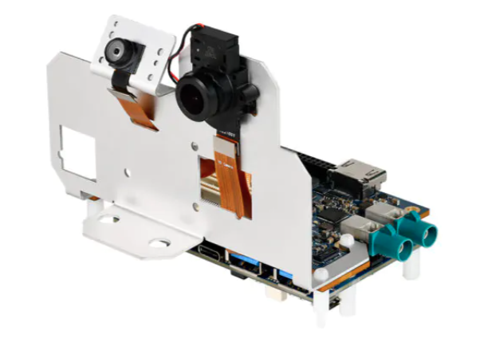
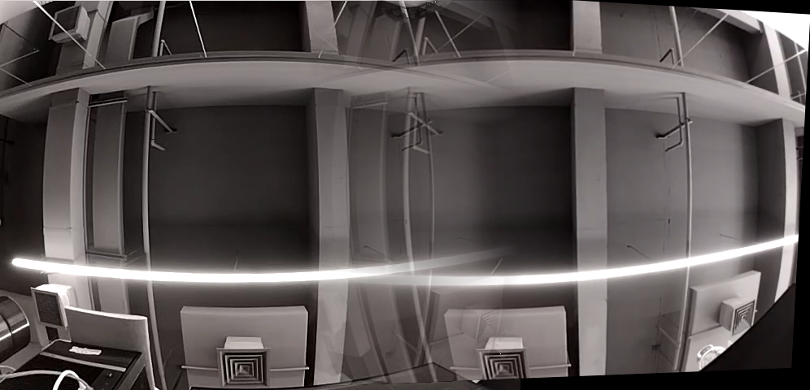

# Qualcomm® QRB2210 Open Kits ImageMosaic-demo Developer documentation

## Introduce

This project is based on the QRB2210 development kit system source code, running on the QRB2210 development board, make full use of the development kit diverse and powerful connection and computing power. HostAPD and UDHCPD tools were used to enable AP WIFI, GStreamer and ZLMediaKit were used to complete RTSP streaming media function, and image stitching function was realized based on the traditional opencv algorithm.

Sometimes the camera can not capture the whole picture completely, so it needs to shoot several times to record the complete picture. So I wanted to be able to seamlessly combine the contents of multiple frames when I was shooting, so I came up with the idea of writing this example.

**How does it work?**

a.Quickly build AP WIFI through command line tools.</br>
b.Using MediaServer tool and start up the push stream server.</br>
c. Run the gst_mosaic_test command to complete camera data collection and image stitching/mosaic. Push the results to the local port of the device through appsrc.The MediaServer stream server generates the RTSP stream.</br>
d.The mobile connects to QRB2210 AP wifi and plays RTSP streams  for show image mosaic result by EasyPlayer.

Qualcomm® QRB2210 SoC Open Kits


## Materials and Tools used for the project

1. Hardware materials

Except for the Open Kits,The following hardware materials are also needed:

* Type-C usb line

using the usb line to develop on Qualcomm® QRB2210 SoC Open Kits.


* Charger

Direct power supply for Qualcomm® QRB2210 SoC Open Kits.


* Camera Module
Low power camera module



## Environment configuration

This section mainly describes the source and configuration of some open source projects or third-party tools needed in the development process.

### Gstreamer
[Gstreamer](https://www.yoctoproject.org) <br>
GStreamer is a library for constructing graphs of media-handling components. The applications it supports range from simple Ogg/Vorbis playback, audio/video streaming to complex audio (mixing) and video (non-linear editing) processing.

### ZLMediaServer
ZLMediaServer is a high-performance operational level streaming media service framework based on C++11.

url: https://github.com/ZLMediaKit/ZLMediaKit

If you want to compile the project in source code, you can clone the entire project and modify zlmediakit_0.1.bb provided by the project to compile it using yocto.We also provide binary executables "MediaServer" generated by compilation in the bin directory.

### EasyPlayer APP
An free, elegant, simple, fast RTSP/RTMP/HLS/HTTP Player.EasyPlayer support RTSP(RTP over TCP/UDP)version& RTMP version & Pro version，cover all kinds of streaming media！

url: http://app.tsingsee.com/EasyRTSPlayer

### Opencv
OpenCV is a cross-platform computer vision and machine learning software library distributed under the Apache2.0 license (open source).
url: https://opencv.org/

## Compile
No special compilation method is required. After configuring the RB1 special SDK, the product can be generated directly by Cmake compilation.

## Configure and Usage
Start the RB1 and connection RB1 to host by Type-c usb.
### 1. Configure
In the conf directory, a json configuration file is provided. This configuration file is relatively simple. It mainly configures the gstreamer camera pipeline, gstreamer udpsink push pipeline, and tflite yolov5 traffic sign recognition model are mainly configured.

### 2. Usage
The executable files in the bin directory do not require additional command line parameters. The parameters used by the program are configured by the json file, so you only need to put the configuration file in the same directory to execute the program.

```
adb push ./bin/gst_mosaic_test /data/mosaic
adb push ./sh/ap.sh /data/
adb shell
cd data
sh ap.sh
MediaServer -d &
cd ./mosaic
./gst_mosaic_test
```

Connect your phone to the hotspot and use EasyPlayer APP to access the rtsp address:
rtsp://192.168.3.1:554/live/test


**result show**</br>

